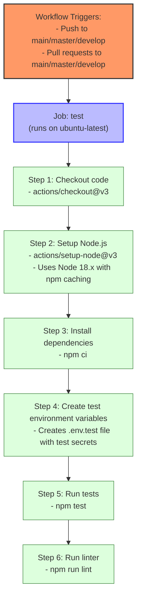
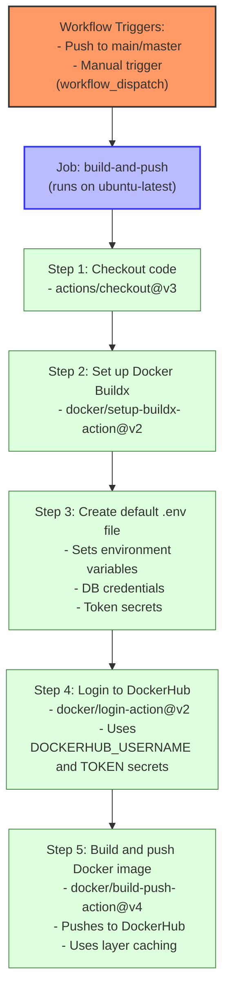

# Auth Service CI/CD Workflows

This document describes the Continuous Integration/Continuous Deployment (CI/CD) workflows set up for the Auth Service using GitHub Actions.

## Workflow Overview

The Auth Service has two main CI/CD workflows:

1. **Run Tests** (`run-tests.yml`) - Runs automated tests on code changes
2. **Build and Push Docker Image** (`docker-build.yml`) - Builds and publishes Docker images

## Run Tests Workflow

This workflow automatically runs whenever code is pushed or a pull request is created, ensuring that code changes don't break existing functionality.

### Key Features:
- **Node.js Setup**: Configures the Node.js environment with dependency caching for faster runs
- **Dependency Installation**: Uses `npm ci` for clean, reproducible installations
- **Test Environment**: Creates a dedicated test environment with secure test values
- **Full Test Suite**: Runs all tests including unit and integration tests
- **Code Quality**: Runs the linter to ensure code style consistency

## Build and Push Docker Image Workflow

This workflow builds and pushes a Docker image to DockerHub when code is pushed to the main branch or triggered manually.

### Key Features:
- **Docker Buildx**: Uses Docker's Buildx for efficient multi-platform builds
- **Environment Configuration**: Creates a default environment config for the container
- **DockerHub Integration**: Authenticates and pushes to DockerHub
- **Build Optimization**: Utilizes layer caching to speed up builds

## CI/CD Pipeline Integration

These workflows work together to form a complete CI/CD pipeline:

1. When code is pushed or PRs are created, tests run automatically
2. After successful merge to main, the Docker image is built and pushed
3. The updated image can then be deployed to staging/production environments

## Required Secrets

For these workflows to function properly, the following secrets should be configured in your GitHub repository:

- `ACCESS_TOKEN_SECRET`: JWT access token secret
- `REFRESH_TOKEN_SECRET`: JWT refresh token secret
- `DOCKERHUB_USERNAME`: DockerHub username for image publishing
- `DOCKERHUB_TOKEN`: DockerHub access token for authentication
